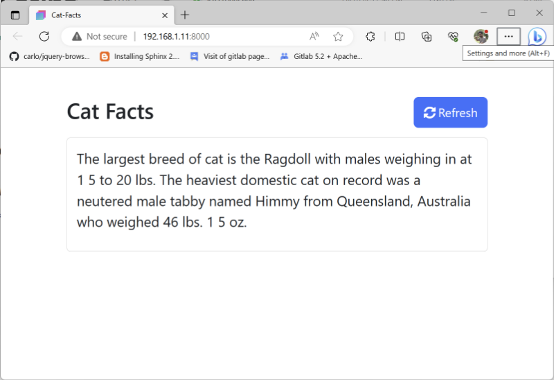

# Fetch Cat Facts

A simple implementation of HTML, CSS and JavaScript to demonstrate how to get data from external sources using the HTML5 Fetch API and JavaScript.

I am using the data from open, public and free REST API https://catfact.ninja/ 